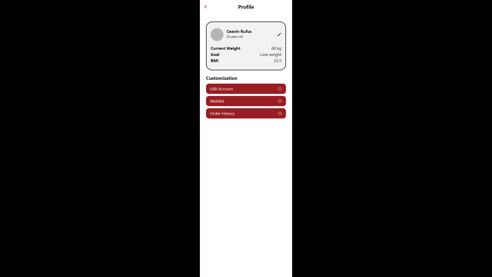
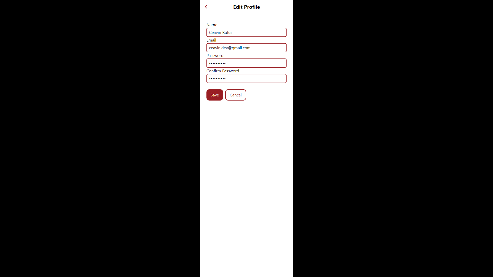

# Tim AADA

## Anggota Tim

- Hilmi Baskara Radanto (Hustler)
- Ceavin Rufus De Prayer Purba (Hacker)
- Syafiq Ziyadul Arifin (Hacker)
- Carissa Tabina Rianda (Hipster)

## Screenshot
- Profile
  
- Edit Profile
  

## How to Use
0. Set environment variables: Create a .env file in the project's root directory. Fill in the following variables:
    - **NEXT_PUBLIC_BACKEND_URL**: The URL of the backend server.
    - **NEXT_PUBLIC_HEADER**: The authorization bearer header in JSON format.
1. Install dependencies: `npm install`
2. Start the development server: `npm run dev`